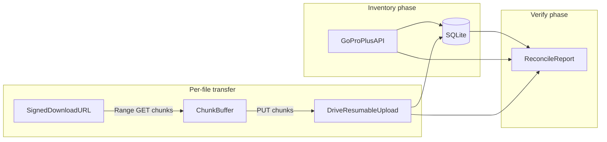

# GoPro Cloud → Google Drive migration (resumable, low-disk)

Build a Python CLI that inventories GoPro Plus cloud media, streams each file to Google Drive in fixed-size chunks (minimal disk), persists progress in SQLite for sleep-safe resume, and provides verify/reconcile commands against both clouds.

## Context

- Workspace [`/Users/andy/Documents/gopro-upload`](/Users/andy/Documents/gopro-upload) is **empty** — greenfield.
- There is **no official public GoPro Cloud bulk-download API**. Community tools ([itsankoff/gopro-plus](https://github.com/itsankoff/gopro-plus), [legosx/gopro-media-library-verifier](https://github.com/legosx/gopro-media-library-verifier)) reverse-engineer the **GoPro Plus media library** at `https://plus.gopro.com/media-library/` using browser session cookies (`gp_access_token`, `gp_user_id`).
- Your scale (~50–500 GB) fits a **sequential, chunked pipeline** on a laptop: one file at a time, 8–32 MB in flight, SQLite for state.



---

## Recommended approach

### Why not “pure pipe with zero disk”?

A naive HTTP stream → Drive pipe works only while the process stays awake. After sleep or crash you lose the in-memory pipe. **Resumable uploads require knowing bytes already committed on Drive** and re-fetching the remainder from GoPro.

**Practical model:** *chunked pass-through* — never store the full video, only the current chunk (default **16 MB**, configurable). Peak disk ≈ one chunk + SQLite + logs (~20–50 MB unless you opt into a spool directory on an external drive).

### Matching files across systems

Do **not** rely on filename alone (duplicates, re-exports). Store GoPro’s stable `media_id` in Drive **`appProperties`**:

```json
{ "gopro_media_id": "<id>", "gopro_capture_time": "...", "migrator_version": "1" }
```

Reconciliation keys (in order):

1. `gopro_media_id` (authoritative)
2. `filename` + `size_bytes` + `capture_time` (fallback)
3. Drive `md5Checksum` vs GoPro checksum **only if** the list API exposes one (often it does not — plan assumes size + id)

---

## Authentication

| System | Method | Notes |
|--------|--------|-------|
| **GoPro** | Manual: copy `gp_access_token` + `gp_user_id` from browser DevTools on `plus.gopro.com` (same flow as [gopro-plus README](https://github.com/itsankoff/gopro-plus)) | JWT expires; CLI detects `401`, prints refresh instructions, pauses queue |
| **Google Drive** | OAuth 2.0 desktop flow; save **refresh token** to `~/.config/gopro-upload/google_token.json` (path configurable) | Scopes: `drive.file` (create in one folder) or `drive` if you need broad verify |

**First-run discovery command** (`gopro-upload doctor`): calls GoPro list API once; if it fails, prints whether cookies are wrong vs wrong product (Quik vs Plus).

---

## SQLite schema (source of truth)

File: `data/migration.db` (gitignored)

**`assets`** — one row per GoPro media item

| Column | Purpose |
|--------|---------|
| `media_id` | PK from GoPro |
| `filename`, `size_bytes`, `mime_type`, `capture_time` | Inventory + matching |
| `gopro_checksum` | Nullable |
| `status` | `pending` → `transferring` → `verifying` → `done` \| `failed` \| `skipped` |
| `bytes_uploaded` | Resume offset on Drive |
| `drive_file_id`, `drive_upload_uri` | Resumable session (URI may expire — re-initiate if needed) |
| `download_url`, `download_url_expires_at` | Refresh before transfer |
| `attempt_count`, `last_error`, `updated_at` | Ops / debugging |

**`transfer_log`** — append-only events (start chunk, 401, sleep resume, verify pass/fail)

**`sync_runs`** — inventory/verify run metadata (timestamps, counts)

Indexes on `status`, `media_id`, `drive_file_id`.

---

## Transfer pipeline (per asset)

1. **Inventory** (idempotent): paginate GoPro search/list API; upsert `assets` with `status=pending` if not `done`.
2. **Pick work**: `SELECT … WHERE status IN ('pending','failed') OR (status='transferring' AND updated_at < …)` — recover stale `transferring` after crash.
3. **Resolve download URL**: fetch/refresh signed URL; record expiry.
4. **HEAD or Range probe**: confirm `Accept-Ranges` and total size matches inventory.
5. **Start or resume Drive upload**:
   - `POST …/upload/drive/v3/files?uploadType=resumable` with metadata + `appProperties`
   - If `drive_upload_uri` exists: `PUT` with `Content-Range: bytes */{size}` to query status ([Drive resumable guide](https://developers.google.com/workspace/drive/api/guides/manage-uploads))
   - Upload chunks with `Content-Range: bytes {start}-{end}/{size}` (chunk size multiple of **256 KB**)
6. **For each chunk**: `GET` GoPro URL with `Range: bytes={start}-{end}` → `PUT` to Drive session URI.
7. **Finalize**: receive `drive_file_id`; set `status=verifying`.
8. **Verify row**: `files.get` with `fields=size,md5Checksum,appProperties`; compare size (+ checksum if available); set `done` or `failed`.

**Concurrency:** default **1** active transfer (laptop-friendly). Optional `--parallel 2` later; not in v1.

**Politeness:** exponential backoff on 429/5xx; max retries per asset (e.g. 5).

---

## Commands (CLI)

Built with **Python 3.11+**, **Typer**, **httpx**, **google-api-python-client**.

| Command | Role |
|---------|------|
| `doctor` | Test GoPro + Google auth; confirm API access |
| `auth google` | OAuth setup |
| `auth gopro` | Save token/user id (prompt or env) |
| `inventory` | Full/paginated GoPro scan → SQLite |
| `migrate` | Process queue until stopped (`Ctrl+C` safe) |
| `migrate --limit N` | Batch for testing |
| `status` | Summary: pending / done / failed / bytes remaining |
| `verify` | Triangulation report (see below) |
| `retry-failed` | Reset `failed` → `pending` |

Config: `config.yaml` — `drive_folder_id`, `chunk_size_mb`, `db_path`, paths to secrets (env vars override).

---

## Verify / checks and balances

`verify` produces a report with four buckets:

| Bucket | Meaning | Action |
|--------|---------|--------|
| **OK** | In GoPro, in Drive (matched `gopro_media_id`), SQLite `done`, sizes match | None |
| **Missing on Drive** | In GoPro + SQLite not `done` | Run `migrate` |
| **Orphan on Drive** | Drive file has no GoPro counterpart in latest inventory | Manual review (don’t auto-delete) |
| **Mismatch** | Same `media_id` but size differs | Mark `failed`, optional re-upload after user confirm |
| **Stale SQLite** | `done` but file removed from Drive | Reset to `pending` |

Implementation:

1. Refresh GoPro inventory into temp table or compare live list.
2. `files.list` in target Drive folder (`q='{folder_id}' in parents and trashed=false'`), paginated.
3. Join on `appProperties.gopro_media_id` then fallback keys.
4. Write human-readable report + optional JSON to `reports/verify-{timestamp}.json`.

---

## Handling laptop sleep / multi-session

- **Process exit or sleep mid-chunk:** on next `migrate`, query Drive resumable status → set `bytes_uploaded` → continue chunk loop from that offset.
- **Expired GoPro URL:** re-fetch metadata for `media_id` before resuming.
- **Expired Drive upload URI:** start new resumable session; if partial file exists on Drive, use [upload with existing file id](https://developers.google.com/workspace/drive/api/guides/manage-uploads) or delete incomplete file and restart (document behavior in README).
- **Idempotent inventory:** re-running `inventory` does not reset `done` rows unless `--force-refresh`.

Optional: `launchd`/`systemd` user timer is out of scope for v1; manual re-run of `migrate` is enough.

---

## Project layout

```
gopro-upload/
├── README.md                 # auth how-to, limits, risks
├── pyproject.toml            # httpx, google-api-python-client, typer, pydantic
├── config.example.yaml
├── src/gopro_upload/
│   ├── cli.py
│   ├── config.py
│   ├── db.py                 # schema + migrations
│   ├── gopro/
│   │   ├── client.py         # list, metadata, download URL (port patterns from gopro-plus)
│   │   └── auth.py
│   ├── drive/
│   │   ├── client.py         # resumable chunked upload
│   │   └── auth.py
│   ├── transfer.py           # chunk loop + resume
│   ├── inventory.py
│   └── verify.py
├── data/                     # gitignored: migration.db
└── reports/                  # gitignored
```

**Reuse, don’t fork wholesale:** read [itsankoff/gopro-plus](https://github.com/itsankoff/gopro-plus) for endpoint shapes and pagination; implement a minimal client in-tree (avoids Docker “download to disk” design).

---

## Risks and mitigations

| Risk | Mitigation |
|------|------------|
| Unofficial GoPro API changes | Pin API version in code comments; `doctor` fails fast; log raw errors |
| Token expiry mid-run | Pause queue; clear message to refresh browser cookie |
| No GoPro checksum | Size + `media_id` matching; optional spot-check download of Drive file header |
| Google quota / rate limits | Sequential transfers; backoff; `status` shows progress |
| Partial Drive uploads | Verify step; don’t mark `done` until `files.get` confirms size |
| Wrong cloud product (not Plus) | `doctor` + README pointer |

---

## Implementation phases

1. **Scaffold** — `pyproject.toml`, Typer CLI, config, SQLite schema + migrations, `.gitignore`.
2. **GoPro client** — auth storage, paginated inventory, download URL + expiry.
3. **Drive client** — OAuth, folder target, resumable upload with chunk resume.
4. **Transfer engine** — chunk loop, stale-state recovery, logging.
5. **Verify** — triangulation report.
6. **README** — step-by-step cookie extraction, Google Cloud project setup, example session (`inventory` → `migrate` → sleep → `migrate` → `verify`).

### Implementation todos

- [ ] Python project scaffold: pyproject.toml, Typer CLI, config.yaml, .gitignore, SQLite schema in db.py
- [ ] GoPro Plus client: cookie auth, paginated inventory, download URL + expiry handling
- [ ] Google Drive OAuth + resumable chunked upload with appProperties.gopro_media_id
- [ ] Chunked Range-GET → Drive PUT loop with resume, stale transferring recovery, logging
- [ ] verify command: triangulate GoPro list vs Drive folder vs SQLite; JSON + human report
- [ ] README: auth setup, doctor command, multi-session workflow, risks

---

## Success criteria

- Full library listed in SQLite without downloading videos to disk.
- A single ~1 GB test clip migrates with **< 50 MB** peak disk (chunk buffer only).
- Kill process mid-transfer; restart `migrate` completes without re-uploading completed bytes.
- `verify` reports 0 missing when migration complete.
- Safe to run across multiple days/sessions until `status` shows all `done`.
